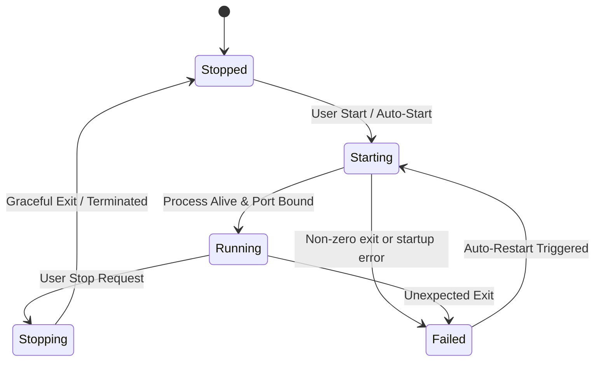

# KAIRO — Architecture Specification

## 1. System Overview

**KAIRO** (Local Runtime Manager for Windows) is a generic, high-performance desktop application engineered for Microsoft Windows to manage arbitrary local background processes, microservices, developer servers, AI backends, and command-line workers.

The system is architected around two decoupled layers:
1. **Frontend (Presentation Layer)**: Built with **React 19**, **TypeScript**, and **Vite**, presenting a developer-first interface governed by the permanent **Black + White + Transparent Glass** design system.
2. **Backend (System & Engine Layer)**: Built in **Rust** using **Tauri 2**, providing low-latency, memory-safe process lifecycle orchestration, Windows Job Object management, asynchronous port monitoring, and disk persistence.

```
┌──────────────────────────────────────────────────────────────────┐
│                      React 19 + TypeScript                       │
│      Black + White + Transparent Glass Developer Interface       │
└─────────────────────────────────┬────────────────────────────────┘
                                  │
                       Tauri 2 Typed IPC (JSON)
           (invoke commands / typed event stream subscriptions)
                                  │
┌─────────────────────────────────▼────────────────────────────────┐
│                           Rust Backend                           │
│  ┌───────────────────────┐             ┌──────────────────────┐  │
│  │    Commands / IPC     │             │   Services / Core    │  │
│  │ (get_app_info, etc.)  │             │  (ProcessManager)    │  │
│  └───────────┬───────────┘             └──────────┬───────────┘  │
│              │                                    │              │
│  ┌───────────▼───────────┐             ┌──────────▼───────────┐  │
│  │   Models & Contracts  │             │ Windows OS Utilities │  │
│  │ (ServiceConfig/State) │             │ (Job Objects, Ports) │  │
│  └───────────────────────┘             └──────────────────────┘  │
└──────────────────────────────────────────────────────────────────┘
```

---

## 2. Frontend / Backend Separation

To ensure modularity, responsiveness, and safety:
- **Zero OS Access from React**: The React UI never spawns child processes directly or executes shell commands. All system capabilities are mediated by the Rust backend via Tauri's security boundary.
- **Stateless UI Rendering**: The UI reflects the current state emitted by the Rust core. Real-time updates (process metrics, state transitions, log chunks) flow from backend to frontend via Tauri event channels (`app.emit(...)`).
- **Compile-Time Contract Guarantees**: Data exchange types are mirrored between TypeScript interfaces (`src/types/index.ts`) and Rust structs (`src-tauri/src/models/mod.rs`), ensuring type safety across IPC boundaries.

---

## 3. IPC Design & Protocol

Inter-Process Communication follows two established paradigms:

### 3.1 Request-Response (Commands)
Synchronous and asynchronous user actions (e.g., adding a service, starting/stopping a process, modifying settings) invoke typed Tauri commands:
```rust
#[tauri::command]
pub async fn start_service(id: String, state: State<'_, AppState>) -> Result<ServiceState, AppError>
```
- **Error Serialization**: The `AppError` type in `src-tauri/src/error.rs` transforms domain and I/O failures into serializable JSON payloads, ensuring clean error surfaces on the client without unhandled promise rejections.

### 3.2 Asynchronous Streaming (Events)
Long-running and high-frequency data streams emit over Tauri events:
- `service://status-changed` (lifecycle transitions: `Stopped` → `Starting` → `Running` → `Stopping` → `Failed`)
- `service://metrics` (CPU %, memory bytes, uptime)
- `service://log-stdout` / `service://log-stderr` (buffered line output)
- `service://port-status` (bound port verification and health checks)

---

## 4. Generic Service Model Concept

The application intentionally avoids domain-specific hardcoding (e.g., Ollama, Node.js, Python, PHP, Java, Docker). Instead, any local workload is modeled as an arbitrary executable instance.

### Configuration Schema (`ServiceConfig`)
```rust
pub struct ServiceConfig {
    /// Unique invariant UUIDv4 identifier
    pub id: String,
    /// User-defined display name
    pub name: String,
    /// Full path or system PATH executable name
    pub executable_path: String,
    /// Argument vector passed directly without shell interpretation
    pub arguments: Vec<String>,
    /// Working directory for execution
    pub working_directory: String,
    /// Custom environment variable key-value pairs
    pub environment_variables: HashMap<String, String>,
    /// Optional TCP port expected to be bound by the service
    pub target_port: Option<u16>,
    /// Launch automatically upon desktop app boot
    pub auto_start: bool,
    /// Restart automatically if process exits unexpectedly
    pub auto_restart: bool,
}
```

This generic paradigm accommodates:
- CLI binaries with arguments (e.g., `ollama serve`)
- Development servers (e.g., `npm run dev`, `vite`, `uvicorn main:app --port 8000`)
- Standalone compiled binaries (e.g., Go, Rust, C++ backend servers)
- Background worker scripts (e.g., Python Celery workers, background syncers)

---

## 5. Runtime State Machine & Telemetry

### 5.1 Lifecycle State Machine
Each service moves deterministically through explicit lifecycle states:



- **Stopped**: Process is idle; no active OS PID assigned.
- **Starting**: Process spawned; awaiting initial health/port verification.
- **Running**: Verified active process; periodic telemetry sampling active.
- **Stopping**: Termination signal dispatched; awaiting exit code or timeout.
- **Failed**: Process exited prematurely with a non-zero code or crashed.

### 5.2 Process Telemetry (`ProcessMetrics`)
- **PID**: OS Process Identifier
- **CPU %**: Sampled kernel and user CPU time across interval
- **Memory**: Private working set bytes
- **Uptime**: Monotonic runtime duration counter

---

## 6. Security Principles

1. **Direct Execution Without Shell Injection**: By default, processes are spawned using `std::process::Command` without wrapping in `cmd.exe /c` or `powershell -Command` unless explicitly requested by configuration. This eliminates shell argument injection vectors.
2. **Localhost Isolation**: The application and its IPC listen exclusively on local loopback sockets / native OS pipes.
3. **Path Validation**: Executable paths and working directories are validated for existence and accessibility before launch attempts.
4. **Environment Sanitization**: Custom environment variables are strictly isolated and passed directly to child process descriptors.
5. **Least Privilege Principle**: The application operates without requiring elevated administrator privileges under standard operation.

---

## 7. Windows-First Design

Because Windows is the primary deployment target, the backend implements Windows-specific OS primitives:

1. **Job Objects (`CreateJobObjectW`)**:
   - On Windows, child processes spawned by a process (and their subprocesses) can easily become orphaned zombies if the parent terminates or if `SIGTERM` is not recognized.
   - Every managed process tree will be assigned to a Windows Job Object configured with `JOB_OBJECT_LIMIT_KILL_ON_JOB_CLOSE`. When the manager terminates or a service is stopped, the entire process hierarchy is guaranteed to terminate cleanly.
2. **Console Suppression (`CREATE_NO_WINDOW`)**:
   - Services spawned from the GUI set the `CREATE_NO_WINDOW` creation flag (0x08000000) so no extraneous console windows flash or steal desktop focus.
3. **Native Auto-Start**:
   - Integration with the Windows CurrentUser Registry Run key (`HKCU\Software\Microsoft\Windows\CurrentVersion\Run`) or Startup shortcut folder.
4. **Windows Native Port Probing**:
   - Asynchronous TCP socket testing to determine port readiness and detect port collision conflicts.

---

## 8. Future Cross-Platform Considerations

While Windows is prioritized, the architecture maintains clean abstraction boundaries:
- The `ProcessManager` trait abstracts OS process creation.
- Unix implementations will leverage POSIX process groups (`setpgid`, `kill(-pgid, SIGTERM)`) for clean process tree termination equivalent to Windows Job Objects.
- Persistence mechanisms (atomic JSON files / SQLite) and IPC types remain platform-agnostic.

---

## 9. Process I/O Strategy & Future Logging Roadmap

1. **Phase 3 Child Process I/O**:
   - In Phase 3, standard streams (`stdin`, `stdout`, `stderr`) are bound to `Stdio::null()`.
   - This deliberate design prevents child processes from hanging or blocking due to unconsumed pipe buffer saturation when running long-running local background services.
   - Phase 3 strictly focuses on process lifecycle orchestration (start, stop, restart, PID tracking) and does not capture or stream stdout/stderr.
2. **Phase 9 Asynchronous Logging Architecture**:
   - Phase 9 will introduce structured asynchronous log streaming (`Stdio::piped()`), background non-blocking reader threads/tasks, ring buffers, and live frontend event channels (`service://log-stdout`, `service://log-stderr`).
3. **Architectural Compatibility**:
   - The `ProcessManager` architecture maintains direct child handle ownership and lifecycle hooks, ensuring seamless transition to asynchronous pipe streaming in Phase 9 without breaking the core process management engine.

---

## 10. Process Monitoring & Watchdog Architecture (Phase 4)

1. **Separation of Concerns**:
   - **`ProcessManager`**: Responsible strictly for process lifecycle operations (spawning, terminating, restarting, PID tracking, and thread-safe process ownership).
   - **`ProcessMonitor`**: Dedicated background watchdog thread (`lsm-process-monitor`) that periodically reconciles tracked child processes with real OS exit statuses and dispatches events.
2. **Crash & Unexpected Exit Detection**:
   - Polling occurs every 1000ms using non-blocking `Child::try_wait()`.
   - **Intentional Stop**: When a user clicks Stop, the `in_flight` lock and immediate removal from the active map prevent the monitor from falsely flagging the shutdown as a crash.
   - **Unexpected Exit**: When a process exits without user action while tracked as `Running`, the monitor captures the exit code, marks the state as `Failed`, and records the termination message.
3. **Reactive Event Pipeline**:
   - Emits typed `service-runtime-updated` payloads over Tauri IPC.
   - Single central listener in React (`App.tsx`) updates affected service cards and dashboard counters in real time without polling or manual refreshes.
4. **Performance & Resource Constraints**:
   - The monitor uses a single lightweight 1000ms reconciliation interval with non-blocking process checks and is designed to keep monitoring overhead low. Only LSM-managed processes are checked, avoiding broad system process scans.
   - Clean shutdown: thread uses interruptible sleep increments and joins cleanly on application exit.

---

## 11. TCP Port Checking & Service Readiness Architecture (Phase 5)

### 11.1 Decoupled Modular Architecture
Phase 5 maintains strict separation between process management, process observation, and network probing:
- **`PortChecker` (`src-tauri/src/services/port_checker.rs`)**:
  - Independent, stateless utility module dedicated strictly to probing local loopback TCP endpoints.
  - Zero knowledge of child process handles or process lifecycle state.
- **`ProcessManager` (`src-tauri/src/services/process_manager.rs`)**:
  - Owns child process handles, execution state, PID associations, and synchronization locks.
  - Exposes `get_monitored_targets()` for thread-safe read snapshots without holding locks during network I/O.
  - Validates and updates readiness states via `update_port_readiness()`.
- **`ProcessMonitor` (`src-tauri/src/services/process_monitor.rs`)**:
  - Observes and coordinates both unexpected crash detection and port readiness probing within a single unified 1000ms watchdog cycle.
  - Probes ports outside of mutex boundaries to prevent blocking process operations.

### 11.2 Readiness State Semantics
Process lifecycle state and network readiness are fundamentally distinct:
- **No process**: `Stopped`
- **Process launching**: `Starting`
- **Process alive + no configured port**: `Running`
- **Process alive + configured port not listening**: `Running` (UI port tag: `Waiting...`)
- **Process alive + configured port listening**: `Ready` (UI badge and port tag: `Ready`)
- **Unexpected process termination**: `Failed` (Phase 4 rule strictly preserved; port absence never triggers `Failed`).

### 11.3 Port Ownership & Boundary Rules
- KAIRO verifies that the configured TCP loopback endpoint is actively accepting connections.
- A listening port does **not** prove that the configured child process owns that port (e.g., another process could be bound). The system reports `Port listening / Service Ready` without making false claims of exclusive ownership.
- Probing is restricted strictly to local loopback (`127.0.0.1` first, falling back to `[::1]`). No external network discovery, scanning, or arbitrary address connections are permitted.

### 11.4 Concurrency & Stale Result Mitigation
Every asynchronous readiness probe is guarded against race conditions:
1. `get_monitored_targets()` captures the `(service_id, pid, port)` snapshot.
2. `PortChecker::check_local_port()` performs `TcpStream::connect_timeout` (150ms timeout) **outside** the `ProcessManager` lock.
3. `update_port_readiness()` checks:
   - Service is not in `in_flight` (user is not currently stopping or restarting).
   - Service still exists in tracked processes.
   - Target PID strictly matches `expected_pid` (rejects stale probe results from an old PID after restart).
   - Target child process is still alive (`try_wait() == Ok(None)`).
4. Emits `service-runtime-updated` events strictly when a real state transition occurs (`Running → Ready`, `Ready → Running`), preventing event flooding.

### 11.5 Performance Considerations
- Uses a single centralized background thread (the existing Phase 4 `ProcessMonitor`).
- Zero per-service threads or high-frequency polling loops.
- Local loopback connections resolve in sub-millisecond time on Windows; the 150ms timeout safely bounds worst-case delays.
- Mutex contention is avoided by executing network probes completely outside of synchronization locks.


